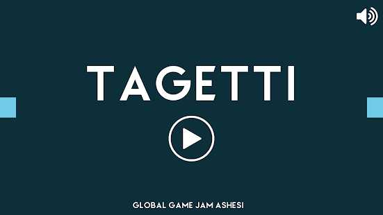
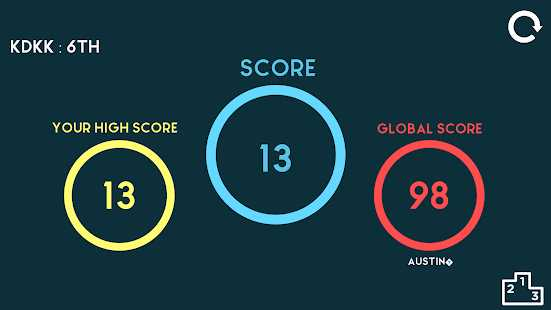
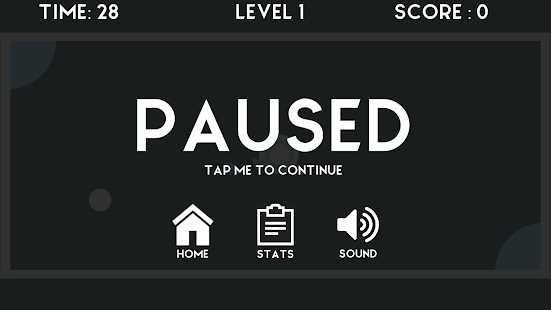
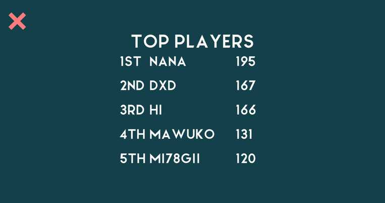

# Tagetti
A 2D skill-based arcade game I built with friends at the Global Game Jam, Ashesi. I used Unity3D (C#) for the game and Node.js for the leaderboard backend API. 

## Play 
1. Android: [Google Playstore](https://play.google.com/store/apps/details?id=com.ggjAshesi.tagetti&hl=en)  
2. Web: [CrazyGames](https://crazygames.com/game/tagetti)

## Screenshots 
Main Screen  
  

Stats Screen  
  

Pause Screen  
  

Leaderboard Screen (Powered by the [Backend API](https://github.com/kevin-deyoungster/Tagetti/tree/master/Backend))  
  

[Game Page on Global Game Jam Website](https://globalgamejam.org/2017/games/tagetti)
